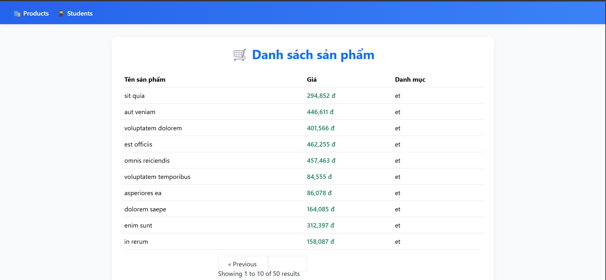
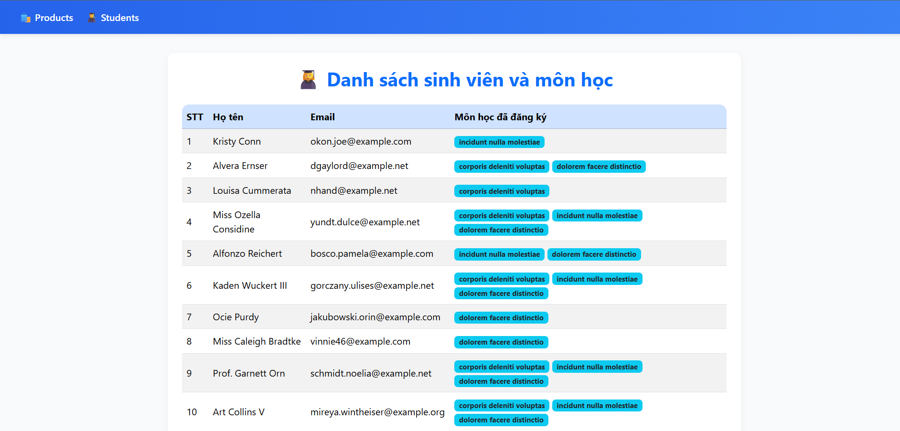

# Lab 08 – Open Source Programming

## About Project

**EN:** This repository contains assignments **01 → 04** of **Lab 08** in the course _Open Source Programming_.  
**VN:** Repository này bao gồm các bài tập **01 → 04** của **Lab 08** trong môn học _Lập trình mã nguồn mở_.

-   **Student**: Nguyễn Phú Tài
-   **Student ID**: 2001226447

---

## Technologies Used

-   **PHP / Laravel**
-   **MySQL**
-   **HTML / CSS**

---

## Demo Screenshots

### 1️⃣ Danh sách sản phẩm

### 2️⃣ Danh sách sinh viên

---
